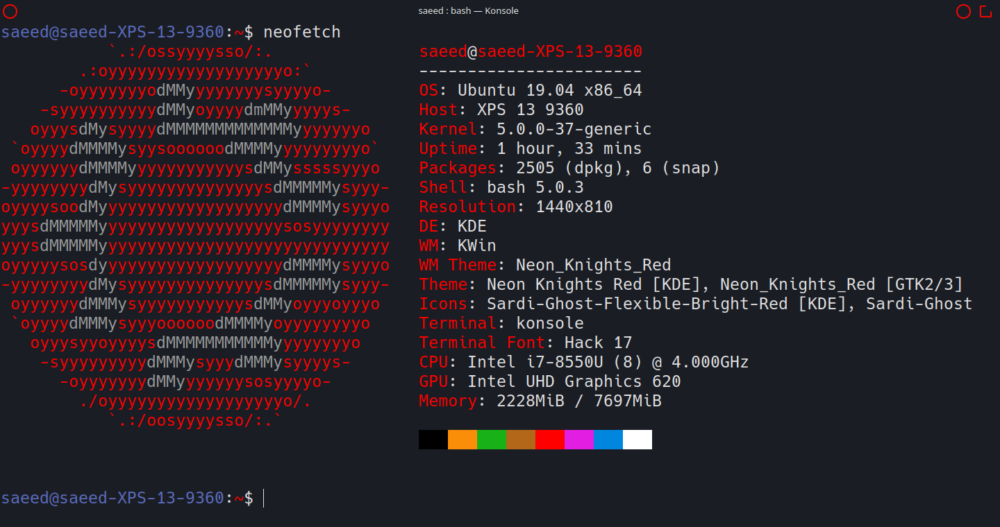
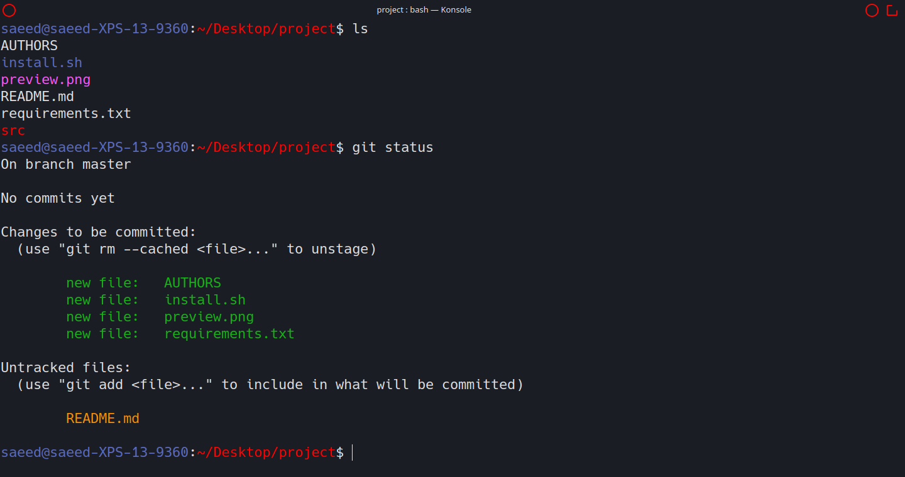

# Stone Red
A Konsole colorscheme

  

  
    Aurorae Decoarations: <a href="https://store.kde.org/p/1320441">Neon Knights</a>
  

Example of what the colorscheme looks like in action:

  

## Installation
1. Download the [latest release](https://github.com/SaeedBaig/stone-red-konsole/releases/).
2. Move the `Stone-Red.colorscheme` file to `~/.local/share/konsole/`
